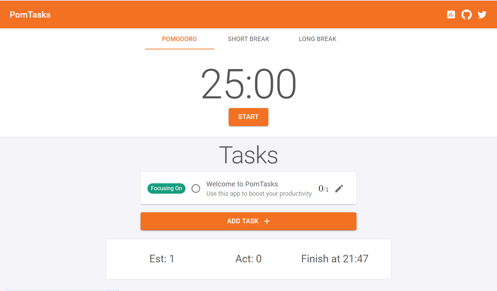

# PomTasks

PomTasks is an online pomodoro timer that boosts your productivity by helping you focus on the tasks you are doing.
## Installation
1.Clone the repo
```bash
git clone https://github.com/TebzTYheMan/PomTasks.git
```
2.Install NPM packages
```bash
npm install || yarn install
```
## Contributing
Pull requests are welcome. For major changes, please open an issue first to discuss what you would like to change.

## License
[MIT](https://choosealicense.com/licenses/mit/)